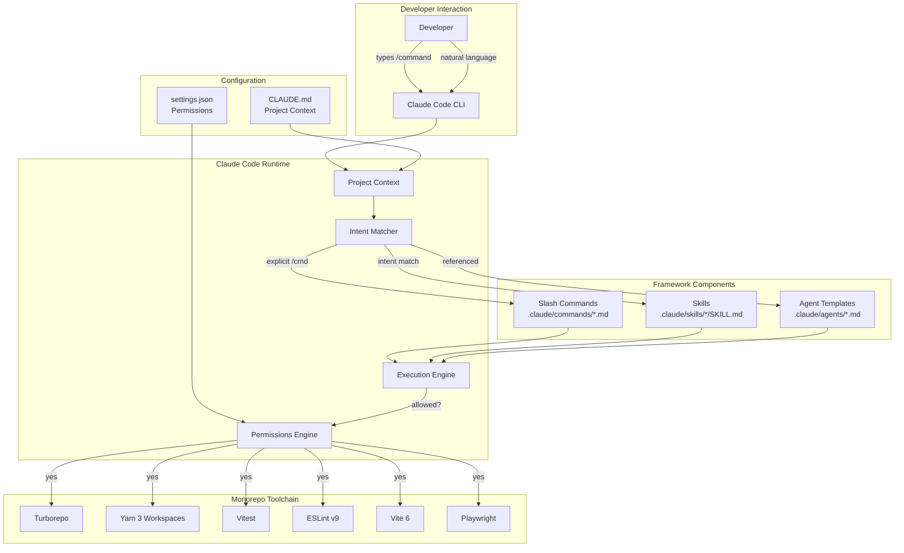
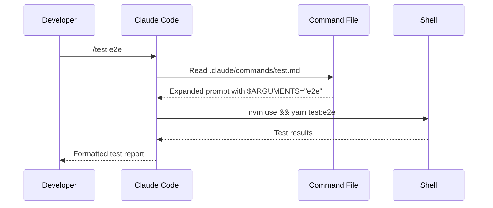
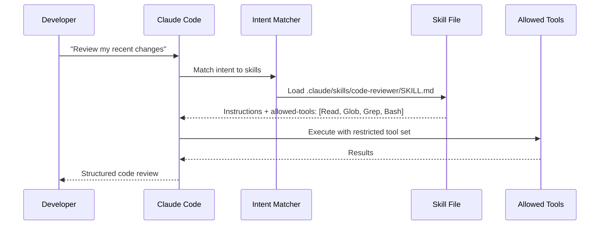
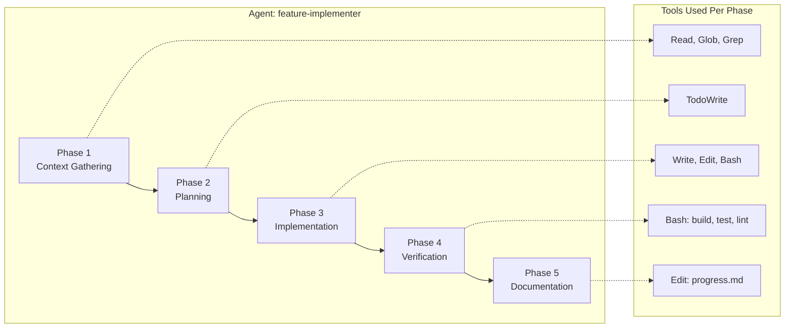
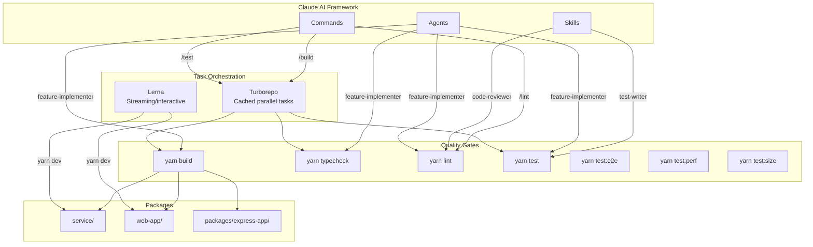
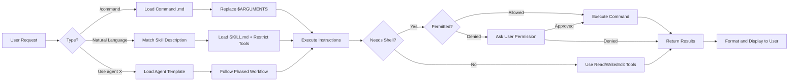

# Architecture Overview

This document describes the architecture of the Claude AI development framework, how its components interact, and how it integrates with the monorepo's toolchain.

## System Architecture Diagram



## Component Details

### Project Context (`CLAUDE.md`)

The `CLAUDE.md` file at the repo root is the foundation of the framework. Claude reads it on startup and uses it throughout the session for:

- **Architecture knowledge**: Package structure, dependency graph, file conventions
- **Code conventions**: TypeScript settings, import patterns, testing frameworks
- **Common tasks**: Build, test, lint commands with correct flags
- **Gotchas**: Known issues and workarounds specific to this monorepo

**File**: `CLAUDE.md` (repo root)

### Permissions (`settings.json`)

The `.claude/settings.json` file controls what Claude can do automatically without asking for confirmation:

```json
{
  "permissions": {
    "allow": ["Bash(yarn build*)", "Bash(yarn test*)", "Bash(git status*)"],
    "deny": ["Bash(git push --force*)", "Bash(rm -rf /)*"]
  }
}
```

**File**: `.claude/settings.json`

**Design principle**: Allow safe, reversible operations. Deny destructive or irreversible ones.

### Slash Commands

Commands map user-typed invocations to structured prompts:



| Command        | File                              | Arguments                    |
| -------------- | --------------------------------- | ---------------------------- |
| `/build`       | `.claude/commands/build.md`       | None                         |
| `/test`        | `.claude/commands/test.md`        | `unit\|e2e\|perf\|size\|all` |
| `/lint`        | `.claude/commands/lint.md`        | `fix` (optional)             |
| `/new-package` | `.claude/commands/new-package.md` | `<package-name>`             |

### Skills

Skills are intent-triggered specialists. Claude matches user intent to skill descriptions and loads the full skill when a match is found:



| Skill                   | Triggers On                                 | Tools                                     |
| ----------------------- | ------------------------------------------- | ----------------------------------------- |
| `code-reviewer`         | "review code", "check my changes"           | Read, Glob, Grep, Bash, Task              |
| `test-writer`           | "write tests for", "add tests to"           | Read, Write, Edit, Glob, Grep, Bash, Task |
| `component-generator`   | "create a component", "scaffold component"  | Read, Write, Edit, Glob, Grep, Bash, Task |
| `perf-analyzer`         | "analyze performance", "check perf results" | Read, Glob, Grep, Bash, Task              |
| `ralph-tui-prd`         | "create a PRD", "plan this feature"         | Read, Write, Edit, Glob, Grep, Bash, Task |
| `ralph-tui-create-json` | "create prd.json", "convert to json"        | Read, Write, Edit, Glob, Grep, Bash, Task |

### Agent Templates

Agent templates define multi-phase workflows for complex tasks. They are not auto-triggered but are referenced explicitly:



| Agent                 | Phases | Key Decision Rules                                       |
| --------------------- | ------ | -------------------------------------------------------- |
| `feature-implementer` | 5      | Fix implementation (not tests); follow codebase patterns |
| `migration-helper`    | 6      | Pre-migration baseline; incremental verification         |
| `pr-creator`          | 5      | Conventional commits; never force-push                   |

## Integration with Monorepo Toolchain

The framework integrates with the monorepo's existing toolchain rather than replacing it:



### Key Integration Points

| Tool       | How the Framework Uses It                                                    |
| ---------- | ---------------------------------------------------------------------------- |
| Turborepo  | Commands and agents run `turbo run build\|test\|typecheck` for cached builds |
| Lerna      | Commands use `lerna run` for `dev` and `start` (streaming tasks)             |
| Vitest     | Test-writer skill generates Vitest tests; agents verify with `yarn test`     |
| ESLint v9  | Lint command runs `eslint` with flat config; code-reviewer checks compliance |
| Vite       | Component-generator skill understands Vite's build and dev server            |
| Playwright | Test command supports `yarn test:e2e`; agents verify E2E after changes       |
| Autocannon | Perf-analyzer skill reads autocannon results from `perf-results/`            |
| size-limit | Test command supports `yarn test:size`; agents check bundle size impact      |

## Data Flow: From User Request to Execution



## Directory Structure Summary

```
lerna-monorepo-sample/
├── CLAUDE.md                              # Project context (read on startup)
├── .claude/
│   ├── settings.json                      # Tool permissions
│   ├── commands/                          # User-invoked slash commands
│   │   ├── build.md
│   │   ├── test.md
│   │   ├── lint.md
│   │   └── new-package.md
│   ├── skills/                            # Intent-triggered skills
│   │   ├── code-reviewer/SKILL.md
│   │   ├── test-writer/SKILL.md
│   │   ├── component-generator/SKILL.md
│   │   ├── perf-analyzer/SKILL.md
│   │   ├── ralph-tui-prd/SKILL.md
│   │   └── ralph-tui-create-json/SKILL.md
│   └── agents/                            # Multi-phase workflow templates
│       ├── feature-implementer.md
│       ├── migration-helper.md
│       └── pr-creator.md
└── docs/ai-framework/                     # This documentation
    ├── getting-started.md
    ├── architecture.md
    ├── creating-skills.md
    ├── creating-commands.md
    ├── creating-agents.md
    └── best-practices.md
```
